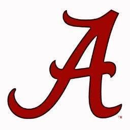

# CFB Extended Records

This is an algorithm used to rank college football teams using only who each team has played and who won.
*67.5% successful predictions after week 4*

*   This is an attempt to remove any preseason bias and emphasize teams' records
*   This removes any recency bias by weighing a week 1 win the same as a week 11 win
*   This doesn't make any distinction between close wins or blowouts, as Herm Edwards said best "You play to win the game"
*   An Extended Record is a combination of extended wins and extended losses
    *   Extended Wins = # of wins of opponents they beat
    *   Extended Losses = # of losses of opponents who beat them
    *   Extended Win Rate = Extended Wins / (Extended Wins + Extended Losses)

To run the program: 
*   run `cfbExtendedRecord.py`
    *   Adding command line argument `noFCS` removes FCS games from all records
    *   Adding command line argument `rating` adds a rating to each team using their record, extended record, conference's record and conference's extended record
    *   Adding command line argument `week##` runs the program through that week
    *   Adding command line argument `printAll` to output all of the data
        *   `printC` to print the conference extended results
        *   `printP` to show the predictions for the next week
*   run `updateCSV.py` to update `data/record.csv` from https://www.sports-reference.com/cfb/years/2024-schedule.html
    *   Add `2019`, `2020`, `2021`, `2022`, `2023` to use that year's data

## Current Rankings

[Full Rankings](results/resultsSorted.csv)

| Rank | Logo | Name | Record | Extended Record | Extended Win Rate |
| --- | :---: | --- | --- | --- | --- |
| 1 |  | Oregon | 13-1 | 88-2 | 0.97778 |
| 2 |  | Ohio State | 14-2 | 119-6 | 0.952 |
| 3 |  | Boise State | 12-2 | 68-4 | 0.94444 |
| 4 |  | Penn State | 13-3 | 82-5 | 0.94253 |
| 5 |  | Notre Dame | 14-2 | 108-7 | 0.93913 |
| 6 |  | Indiana | 11-2 | 49-4 | 0.92453 |
| 7 |  | Texas | 13-3 | 91-8 | 0.91919 |
| 8 |  | Army | 12-2 | 56-5 | 0.91803 |
| 9 |  | Georgia | 11-3 | 74-9 | 0.89157 |
| 10 |  | Nevada-Las Vegas | 11-3 | 48-7 | 0.87273 |
| 11 |  | Southern Methodist | 11-3 | 60-9 | 0.86957 |
| 12 |  | Brigham Young | 11-2 | 60-10 | 0.85714 |
| 13 |  | Illinois | 10-3 | 50-9 | 0.84746 |
| 14 |  | Memphis | 11-2 | 49-9 | 0.84483 |
| 15 |  | Miami (FL) | 10-3 | 54-12 | 0.81818 |
| 16 |  | Iowa State | 11-3 | 67-15 | 0.81707 |
| 17 |  | Arizona State | 11-3 | 65-15 | 0.8125 |
| 18 |  | Tennessee | 10-3 | 45-11 | 0.80357 |
| 19 |  | Missouri | 10-3 | 53-13 | 0.80303 |
| 20 |  | Navy | 10-3 | 60-15 | 0.8 |
| 21 |  | South Carolina | 9-4 | 54-14 | 0.79412 |
| 22 |  | Michigan | 8-5 | 61-16 | 0.79221 |
| 23 |  | Ohio | 11-3 | 58-16 | 0.78378 |
| 24 |  | Marshall | 10-3 | 50-14 | 0.78125 |
| 25 |  | Syracuse | 10-3 | 74-21 | 0.77895 |

## With Ratings

| Rank | Logo | Name | Record | Extended Record | Extended Win Rate | Rating |
| --- | :---: | --- | --- | --- | --- | --- |
| 1 |  | Ohio State | 14-2 | 119-6 | 0.952 | 2.13377 |
| 2 |  | Notre Dame | 14-2 | 108-7 | 0.93913 | 2.04636 |
| 3 |  | Oregon | 13-1 | 88-2 | 0.97778 | 1.89947 |
| 4 |  | Texas | 13-3 | 91-8 | 0.91919 | 1.77403 |
| 5 |  | Penn State | 13-3 | 82-5 | 0.94253 | 1.72138 |
| 6 |  | Boise State | 12-2 | 68-4 | 0.94444 | 1.5952 |
| 7 |  | Georgia | 11-3 | 74-9 | 0.89157 | 1.54954 |
| 8 |  | Army | 12-2 | 56-5 | 0.91803 | 1.45839 |
| 9 |  | Brigham Young | 11-2 | 60-10 | 0.85714 | 1.41321 |
| 10 |  | Indiana | 11-2 | 49-4 | 0.92453 | 1.39842 |
| 11 |  | Southern Methodist | 11-3 | 60-9 | 0.86957 | 1.39011 |
| 12 |  | Iowa State | 11-3 | 67-15 | 0.81707 | 1.37798 |
| 13 |  | Arizona State | 11-3 | 65-15 | 0.8125 | 1.35592 |
| 14 |  | Syracuse | 10-3 | 74-21 | 0.77895 | 1.35191 |
| 15 |  | Memphis | 11-2 | 49-9 | 0.84483 | 1.3005 |
| 16 |  | Nevada-Las Vegas | 11-3 | 48-7 | 0.87273 | 1.28079 |
| 17 |  | Navy | 10-3 | 60-15 | 0.8 | 1.27572 |
| 18 |  | Illinois | 10-3 | 50-9 | 0.84746 | 1.26913 |
| 19 |  | Miami (FL) | 10-3 | 54-12 | 0.81818 | 1.25956 |
| 20 |  | Ohio | 11-3 | 58-16 | 0.78378 | 1.25238 |
| 21 |  | Mississippi | 10-3 | 59-17 | 0.77632 | 1.25027 |
| 22 |  | Missouri | 10-3 | 53-13 | 0.80303 | 1.24229 |
| 23 |  | Alabama | 9-4 | 64-21 | 0.75294 | 1.19513 |
| 24 |  | South Carolina | 9-4 | 54-14 | 0.79412 | 1.18366 |
| 25 |  | Tennessee | 10-3 | 45-11 | 0.80357 | 1.18253 |

## Prediction History (Week 5 and later by Year):

| Year | Wins | Losses | Win Rate |
| --- | --- | --- | --- |
| 2019 | 410 | 176 | 70.0% |
| 2020 | 306 | 139 | 68.8% |
| 2021 | 382 | 183 | 67.6% |
| 2022 | 367 | 199 | 64.8% |
| 2023 | 383 | 193 | 66.5% |

## Prediction History by Week

| Week | Wins | Losses | Win Rate | Special Week? |
| --- | --- | --- | --- | --- |
| 2 | 146 | 85 | 63.2% | |
| 3 | 150 | 99 | 60.2% | |
| 4 | 183 | 100 | 64.7% | |
| 5 | 184 | 128 | 59.0% | |
| 6 | 206 | 98 | 67.8% | |
| 7 | 174 | 107 | 61.9% | |
| 8 | 199 | 106 | 65.2% | |
| 9 | 209 | 113 | 64.9% | |
| 10 | 206 | 107 | 65.8% | |
| 11 | 191 | 81 | 70.2% | |
| 12 | 190 | 87 | 68.6% | |
| 13 | 209 | 73 | 74.1% | |
| 14 | 189 | 77 | 71.1% | |
| 15 | 105 | 37 | 73.9% | |
| 16 | 30 | 20 | 60.0% | Conference Championships
| 17 | 3 | 1 | 75.0% | Army v Navy
| 18 | 87 | 66 | 56.9% | Bowls
| 21 | 15 | 15 | 50.0% | NY6
| 22 | 4 | 1 | 80.0% | National Championship

## 2023 With Ratings

| Rank | Logo | Name | Record | Extended Record | Extended Win Rate | Rating |
| --- | :---: | --- | --- | --- | --- | --- |
| 1 |  | Michigan | 15-0 | 112-0 | 1.0 | 2.23048 |
| 2 |  | Washington | 14-1 | 103-0 | 1.0 | 2.09071 |
| 3 |  | Georgia | 13-1 | 84-2 | 0.97674 | 1.86104 |
| 4 |  | Florida State | 13-1 | 79-1 | 0.9875 | 1.81973 |
| 5 |  | Alabama | 12-2 | 83-2 | 0.97647 | 1.79877 |
| 6 |  | Texas | 12-2 | 86-4 | 0.95556 | 1.79293 |
| 7 |  | Liberty | 13-1 | 73-2 | 0.97333 | 1.73266 |
| 8 |  | Oregon | 12-2 | 70-2 | 0.97222 | 1.66392 |
| 9 |  | Ohio State | 11-2 | 67-2 | 0.97101 | 1.6182 |
| 10 |  | Missouri | 11-2 | 66-4 | 0.94286 | 1.5787 |
| 11 |  | Mississippi | 11-2 | 64-3 | 0.95522 | 1.57427 |
| 12 |  | James Madison | 11-2 | 63-9 | 0.875 | 1.45682 |
| 13 |  | Oklahoma | 10-3 | 68-11 | 0.86076 | 1.43071 |
| 14 |  | Penn State | 10-3 | 57-4 | 0.93443 | 1.42713 |
| 15 |  | Louisiana State | 10-3 | 58-5 | 0.92063 | 1.42409 |
| 16 |  | Troy | 11-3 | 62-11 | 0.84932 | 1.37807 |
| 17 |  | Notre Dame | 10-3 | 53-10 | 0.84127 | 1.32472 |
| 18 |  | Tulane | 11-3 | 54-11 | 0.83077 | 1.28182 |
| 19 |  | Toledo | 11-3 | 57-14 | 0.80282 | 1.26761 |
| 20 |  | Memphis | 10-3 | 48-8 | 0.85714 | 1.24627 |
| 21 |  | Iowa | 10-4 | 57-14 | 0.80282 | 1.23318 |
| 22 |  | Arizona | 10-3 | 52-13 | 0.8 | 1.22686 |
| 23 |  | Southern Methodist | 11-3 | 52-16 | 0.76471 | 1.18209 |
| 24 |  | Kansas State | 9-4 | 54-14 | 0.79412 | 1.17611 |
| 25 |  | Louisville | 10-4 | 61-21 | 0.7439 | 1.17368 |

## 2022

| Rank | Logo | Name | Record | Extended Record | Extended Win Rate | Rating |
| --- | :---: | --- | --- | --- | --- | --- |
| 1 |  | Georgia | 15-0 | 111-0 | 1.0 | 2.22645 |
| 2 |  | Michigan | 13-1 | 83-2 | 0.97647 | 1.84612 |
| 3 |  | Texas Christian | 13-2 | 81-4 | 0.95294 | 1.75689 |
| 4 |  | Ohio State | 11-2 | 69-1 | 0.98571 | 1.65319 |
| 5 |  | Tennessee | 11-2 | 72-5 | 0.93506 | 1.628 |
| 6 |  | Penn State | 11-2 | 68-3 | 0.95775 | 1.61061 |
| 7 |  | Troy | 12-2 | 78-11 | 0.8764 | 1.60106 |
| 8 |  | Tulane | 12-2 | 76-11 | 0.87356 | 1.58017 |
| 9 |  | Alabama | 11-2 | 67-6 | 0.91781 | 1.56024 |
| 10 |  | Southern California | 11-3 | 66-10 | 0.86842 | 1.44185 |
| 11 |  | Clemson | 11-3 | 66-11 | 0.85714 | 1.426 |
| 12 |  | Oregon | 10-3 | 56-5 | 0.91803 | 1.39676 |
| 13 |  | Washington | 11-2 | 58-13 | 0.8169 | 1.34587 |
| 14 |  | Texas-San Antonio | 11-3 | 61-12 | 0.83562 | 1.34467 |
| 15 |  | Louisiana State | 10-4 | 63-12 | 0.84 | 1.33588 |
| 16 |  | Kansas State | 10-4 | 61-11 | 0.84722 | 1.32075 |
| 17 |  | Oregon State | 10-3 | 54-9 | 0.85714 | 1.30936 |
| 18 |  | Florida State | 10-3 | 56-13 | 0.81159 | 1.26809 |
| 19 |  | Notre Dame | 9-4 | 59-18 | 0.76623 | 1.21634 |
| 20 |  | Utah | 10-4 | 58-16 | 0.78378 | 1.21162 |
| 21 |  | Mississippi State | 9-4 | 51-12 | 0.80952 | 1.18228 |
| 22 |  | South Alabama | 10-3 | 40-11 | 0.78431 | 1.11006 |
| 23 |  | Boise State | 10-4 | 54-19 | 0.73973 | 1.10905 |
| 24 |  | Fresno State | 10-4 | 50-17 | 0.74627 | 1.092 |
| 25 |  | UCLA | 9-4 | 48-17 | 0.73846 | 1.06134 |

## 2021:

| Rank | Logo | Name | Record | Extended Record | Extended Win Rate | Rating |
| --- | :---: | --- | --- | --- | --- | --- |
| 1 |  | Georgia | 14-1 | 100-2 | 0.98039 | 2.03504 |
| 2 |  | Alabama | 13-2 | 90-5 | 0.94737 | 1.84018 |
| 3 |  | Cincinnati | 13-1 | 74-2 | 0.97368 | 1.74495 |
| 4 |  | Michigan | 12-2 | 78-3 | 0.96296 | 1.73023 |
| 5 |  | Oklahoma State | 12-2 | 81-8 | 0.91011 | 1.68656 |
| 6 |  | Baylor | 12-2 | 82-9 | 0.9011 | 1.6825 |
| 7 |  | Louisiana | 13-1 | 69-7 | 0.90789 | 1.61634 |
| 8 |  | Ohio State | 11-2 | 72-6 | 0.92308 | 1.60734 |
| 9 |  | Notre Dame | 11-2 | 62-3 | 0.95385 | 1.59 |
| 10 |  | San Diego State | 12-2 | 66-6 | 0.91667 | 1.55427 |
| 11 |  | Michigan State | 11-2 | 66-6 | 0.91667 | 1.54446 |
| 12 |  | Texas-San Antonio | 12-2 | 64-9 | 0.87671 | 1.4737 |
| 13 |  | Oklahoma | 11-2 | 55-4 | 0.9322 | 1.46155 |
| 14 |  | Houston | 12-2 | 50-7 | 0.87719 | 1.35939 |
| 15 |  | Wake Forest | 11-3 | 60-13 | 0.82192 | 1.32797 |
| 16 |  | Pittsburgh | 11-3 | 58-12 | 0.82857 | 1.32096 |
| 17 |  | Clemson | 10-3 | 51-7 | 0.87931 | 1.30638 |
| 18 |  | Brigham Young | 10-3 | 52-11 | 0.8254 | 1.29758 |
| 19 |  | Mississippi | 10-3 | 55-11 | 0.83333 | 1.29501 |
| 20 |  | Utah State | 11-3 | 57-14 | 0.80282 | 1.28089 |
| 21 |  | Wisconsin | 9-4 | 59-14 | 0.80822 | 1.23643 |
| 22 |  | Utah | 10-4 | 55-13 | 0.80882 | 1.21123 |
| 23 |  | Air Force | 10-3 | 45-9 | 0.83333 | 1.2072 |
| 24 |  | Iowa | 10-4 | 53-13 | 0.80303 | 1.20398 |
| 25 |  | Appalachian State | 10-4 | 52-12 | 0.8125 | 1.19699 |

## 2020:

| Rank | Logo | Name | Record | Extended Record | Extended Win Rate | Rating |
| --- | :---: | --- | --- | --- | --- | --- |
| 1 |  | Alabama | 13-0 | 78-0 | 1.0 | 1.86331 |
| 2 |  | Coastal Carolina | 11-1 | 59-1 | 0.98333 | 1.58826 |
| 3 |  | Louisiana | 10-1 | 55-1 | 0.98214 | 1.53431 |
| 4 |  | Brigham Young | 11-1 | 45-1 | 0.97826 | 1.49272 |
| 5 |  | Notre Dame | 10-2 | 44-2 | 0.95652 | 1.40543 |
| 6 |  | Texas A&M | 9-1 | 39-0 | 1.0 | 1.37831 |
| 7 |  | Clemson | 10-2 | 48-3 | 0.94118 | 1.37738 |
| 8 |  | Cincinnati | 9-1 | 43-2 | 0.95556 | 1.37396 |
| 9 |  | Ohio State | 7-1 | 35-0 | 1.0 | 1.30458 |
| 10 |  | Oklahoma | 9-2 | 44-9 | 0.83019 | 1.21755 |
| 11 |  | Georgia | 8-2 | 37-4 | 0.90244 | 1.20941 |
| 12 |  | Iowa State | 9-3 | 42-6 | 0.875 | 1.20703 |
| 13 |  | Liberty | 10-1 | 25-4 | 0.86207 | 1.19702 |
| 14 |  | Ball State | 7-1 | 26-1 | 0.96296 | 1.19096 |
| 15 |  | San Jose State | 7-1 | 26-1 | 0.96296 | 1.18528 |
| 16 |  | Oklahoma State | 8-3 | 39-9 | 0.8125 | 1.09868 |
| 17 |  | Appalachian State | 9-3 | 31-5 | 0.86111 | 1.09826 |
| 18 |  | Miami (FL) | 8-3 | 39-9 | 0.8125 | 1.09175 |
| 19 |  | Buffalo | 6-1 | 13-1 | 0.92857 | 1.02745 |
| 20 |  | Northwestern | 7-2 | 25-6 | 0.80645 | 1.00373 |
| 21 |  | Florida | 8-4 | 31-8 | 0.79487 | 0.981 |
| 22 |  | Texas | 7-3 | 31-9 | 0.775 | 0.97953 |
| 23 |  | Marshall | 7-3 | 27-7 | 0.79412 | 0.95347 |
| 24 |  | Army | 9-3 | 24-11 | 0.68571 | 0.93607 |
| 25 |  | Nevada | 7-2 | 18-5 | 0.78261 | 0.93038 |

## 2019:

| Rank | Logo | Name | Record | Extended Record | Extended Win Rate | Rating |
| --- | :---: | --- | --- | --- | --- | --- |
| 1 |  | Louisiana State | 15-0 | 114-0 | 1.0 | 2.25356 |
| 2 |  | Ohio State | 13-1 | 98-1 | 0.9899 | 2.01357 |
| 3 |  | Clemson | 14-1 | 88-0 | 1.0 | 1.93517 |
| 4 |  | Georgia | 12-2 | 86-8 | 0.91489 | 1.74097 |
| 5 |  | Appalachian State | 13-1 | 76-6 | 0.92683 | 1.70609 |
| 6 |  | Penn State | 11-2 | 71-3 | 0.95946 | 1.64279 |
| 7 |  | Notre Dame | 11-2 | 71-6 | 0.92208 | 1.6357 |
| 8 |  | Memphis | 12-2 | 73-7 | 0.9125 | 1.61438 |
| 9 |  | Oregon | 12-2 | 76-9 | 0.89412 | 1.61403 |
| 10 |  | Oklahoma | 12-2 | 70-5 | 0.93333 | 1.61241 |
| 11 |  | Boise State | 12-2 | 75-11 | 0.87209 | 1.57198 |
| 12 |  | Florida | 11-2 | 59-2 | 0.96721 | 1.53957 |
| 13 |  | Navy | 11-2 | 59-4 | 0.93651 | 1.50024 |
| 14 |  | Cincinnati | 11-3 | 62-5 | 0.92537 | 1.47803 |
| 15 |  | Air Force | 11-2 | 56-4 | 0.93333 | 1.46459 |
| 16 |  | Alabama | 11-2 | 55-4 | 0.9322 | 1.46382 |
| 17 |  | Florida Atlantic | 11-3 | 62-9 | 0.87324 | 1.40007 |
| 18 |  | Minnesota | 11-2 | 54-7 | 0.88525 | 1.39939 |
| 19 |  | Wisconsin | 10-4 | 68-11 | 0.86076 | 1.39903 |
| 20 |  | Baylor | 11-3 | 55-6 | 0.90164 | 1.38601 |
| 21 |  | Louisiana | 11-3 | 58-9 | 0.86567 | 1.36428 |
| 22 |  | Utah | 11-3 | 60-12 | 0.83333 | 1.34453 |
| 23 |  | Auburn | 9-4 | 57-6 | 0.90476 | 1.34224 |
| 24 |  | Iowa | 10-3 | 58-10 | 0.85294 | 1.34024 |
| 25 |  | Southern Methodist | 10-3 | 51-7 | 0.87931 | 1.30988 |
